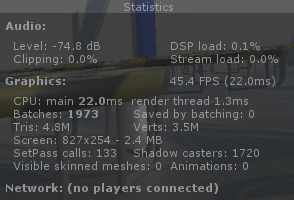
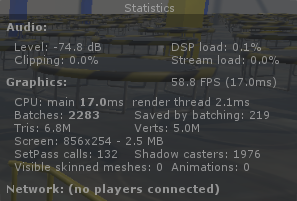
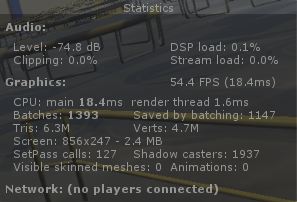
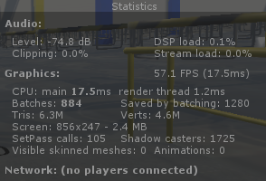
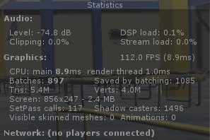
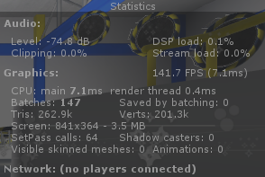

# Udacity VR Nanodegree

## High Immersion Unity, Focus Path: Performance Bounceback

### Developed by **Marcelo Suzumura**

### For which headset?

This project was developed **only** for HTC Vive.
The build file is in the Build folder.

### How much development time?

About 10 hours.

### What I thought was interesting

It was nice to follow the rubric and check the performance gain after each step/optimization.

The steps taken were:

1. **Initial state**: the game was ran without any modification 
    - 45.4 FPS is very bad! I played for a few minutes but the lag was unbearable.
1. **Batching**: turned on dynamic and static batching 
    - It improved the FPS to 58.8, still laggy
1. **Physics**: put rigid bodies on moving objects with colliders and marked all moving objects to not static 
    - It reduced the number of batches, but didn't gain much in FPS
1. **Objects**: ball pooling 
    - I created a fixed number of 200 balls in the start and kept recycling them
    - More reduction in the number of batches
1. **Code**: eliminated useless code and cached some variables 
    - There was a HUGE improvement in this step and the requirement of 90 FPS was met already!
    - The game ran smoothly even with realtime lighting on (and it was beautiful BTW ;~;)
1. **Lighting**: put forward lighting, anti aliasing 8x MSAA, baked lighting and light probes 
    - Now things turned somewhat **ugly**. Although the FPS improved to a whoping 140+ FPS, the lighting gave me a LOT of problems. I even resorted to the forums and found this [post](https://discussions.udacity.com/t/baking-does-not-create-the-lightmaps-properly/259369), discussing problems when the directional lights were baked. Mine gave the same problem described by my fellow colleagues and the scene went all dark (oh the dark ages...). People there mentioned that Unity was behaving weirdly and it could be a bug. I searched Google as well, but didn't find anything that worked, unfortunately.
    - In the end, I baked all the lights, but had to change the range and intensity of the non directional lights to get a poorly-barely-acceptable-lighting with the light probes. IMHO, I think the directional lights could be used as realtime with no problem on this game, as the FPS had already surpassed the 90 mark on the previous step.
    - Given all this ruckus because of the directional lights, I really do hope my submission is acceptable as is.

And of course, it was nice to use the profiler tool as well.